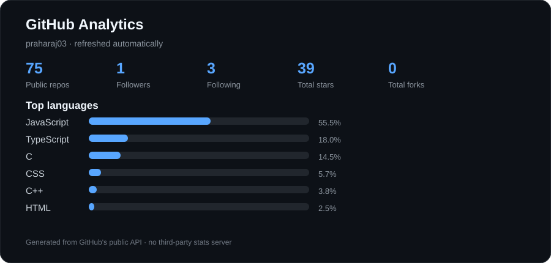
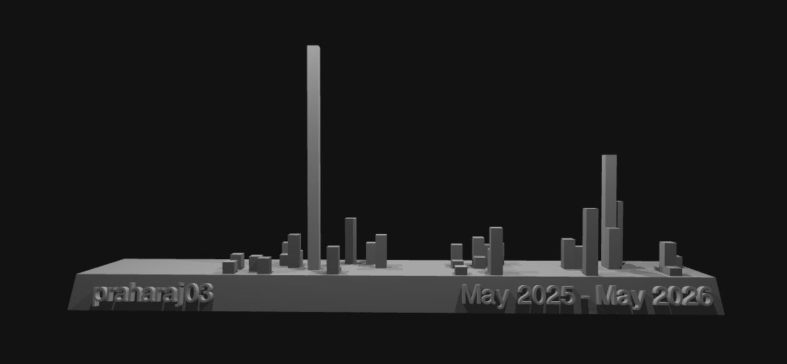

  

---

# 👋 Hi, I'm Abhisek Praharaj

### 💻 A passionate developer from India

## 🚀 About Me

- 🎓 Currently pursuing **B.Tech in Computer Science & Engineering**
- 🌱 Currently learning **MERN • Next.js • Java • AI**
- 💻 Interested in **Web Development • AI • DSA • Backend**
- 🧠 Problem solving with **Java + Algorithms**
- 📫 **abhisekpraharaj246@gmail.com**
- 😄 Pronouns: **Praharaj**
- ⚡ Fun fact: **I Love Tech and Tech Loves Me**

---

# ⚡ Tech Stack

### 👨‍💻 Languages

### 🌐 Frontend

### ⚙️ Backend & Database

### ☁️ Cloud & Tools

---

# 🚀 Featured Projects

<table>
<tr>
<td width="50%" valign="top">

## 🛒 Meta Mart

Full-stack e-commerce platform with authentication, product search and filters, wishlist, cart, Stripe checkout, order tracking and an admin dashboard.

**Stack:** `Next.js` `React` `TypeScript` `Tailwind` `Clerk` `Stripe` `EmailJS`

</td>
<td width="50%" valign="top">

## 📦 StoreIt

Cloud storage application focused on authentication, file management and data handling.

**Stack:** `Next.js` `Appwrite` `Tailwind` `shadcn/ui` `RHF` `Zod` `Recharts`

</td>
</tr>
<tr>
<td width="50%" valign="top">

## 🎫 Queue Management System

Token-based queue management application built with React and Vite.

**Stack:** `React` `Vite` `JavaScript` `Tailwind` `LocalStorage`

</td>
<td width="50%" valign="top">

## 🤖 AI Experiments

Practical experiments with LLMs, AI APIs, prompt engineering, AI-assisted development and automation.

</td>
</tr>
</table>

---

# 🧠 Currently Learning

---

# 📊 GitHub Analytics

> Analytics are generated automatically from GitHub's public API and committed to this repository. No Vercel stats endpoint is used.

---

# 🐍 Contribution Snake

---

# 🪄 My Holopin Badge Board

  
✨ Collecting badges from open-source adventures and tech events! ✨

---

# 🏙️ GitHub Skyline

---

# 💬 Random Developer Quote

---

# 🌐 Let's Connect

---

### ⭐ Thanks for visiting my profile!

**Code. Learn. Build. Repeat. ☕💻**

